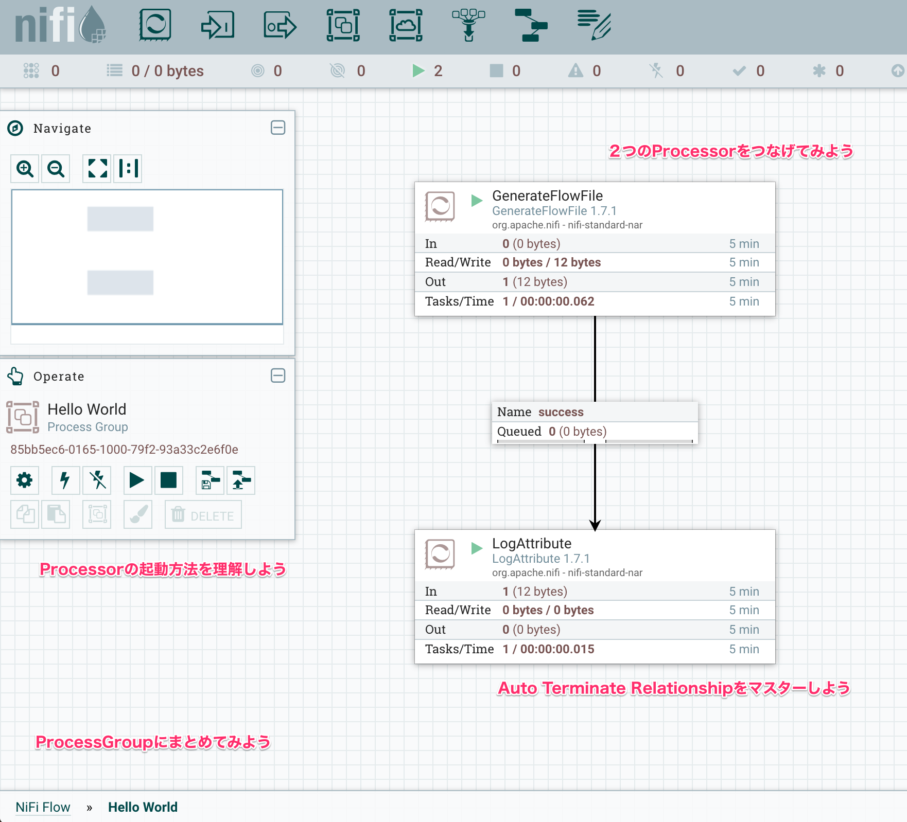

> NiFiってどんなソフトウェアなの？何ができるの？

と聞かれたとき、「NiFiはデータオーケストレーションツール」と答えても、すぐにイメージできる人はそう多くないかもしれません。何年か前に子供へクリスマスプレゼントに[Cuboro](https://cuboro.ch/en/info/products/cuboro_marble_track_system)というおもちゃをあげたのですが、改めて見てみると、これがNiFiにとても良く似ていると思います。

<iframe width="560" height="315" src="https://www.youtube.com/embed/3GZRnr93FOg" frameborder="0" allow="autoplay; encrypted-media" allowfullscreen></iframe>

Cuboroでは木でできたビー玉を通すパーツを自由に組み合わせて、ビー玉の通り道を作っていきます。中にはビー玉をジャンプさせたり、振り分けたりする特殊なパーツもあります。NiFiではビー玉がデータにあたります。データの通り道、すなわちデータフローを部品を組み合わせて作っていくわけです。

さらに、複数のビー玉が同時多発的に流れる様子もNiFiと似ています。NiFiではそれぞれのコンポーネントが独立して動いています。同時に様々なデータがNiFiフロー中の様々な場所を通ります。この点がいわゆるバッチ形式のETLツールよりも、ストリーム性があると言われる点です。ジョブという単位ではなく、一つのデータフローの中をストリーム形式でデータが常に流れているイメージです。

NiFiにおける様々なコンポーネントについての詳細な説明は[ドキュメント](https://nifi.apache.org/docs/nifi-docs/html/user-guide.html#terminology)を参考にしてください。ブラウザの翻訳機能で日本語に簡単に変換できるので、便利な時代になりました。同じ内容を書いてもしょうがないので、適宜公式ドキュメントに飛ばします。

## 一番簡単なデータフローを作ってみよう

まずはNiFiの基本操作から学んでいきましょう。NiFi Web UIから、次のイメージのようなフローを作ってみましょう:

1. GenerateFlowFile Processorを追加する [doc](https://nifi.apache.org/docs/nifi-docs/html/user-guide.html#adding-components-to-the-canvas)
2. GenerateFlowFileで"Hello World"のStringをデータコンテンツに持つFlowFileを生成する [doc](https://nifi.apache.org/docs/nifi-docs/html/user-guide.html#Configuring_a_Processor)
    - それぞれのProcessorで設定項目が異なります、[ドキュメント](https://nifi.apache.org/docs.html)の読み方に慣れましょう
    - UpdateAttributeなど、さらに詳細の"Additional Details..."というリンクを持つものがあります。
3. LogAttributeを追加し、GenerateFlowFileの'success'リレーションシップをつなげる
4. LogAttributeの'success'はAuto Terminateする [doc](https://nifi.apache.org/docs/nifi-docs/html/user-guide.html#settings-tab)
5. GenerateFlowFileをスタートする [doc](https://nifi.apache.org/docs/nifi-docs/html/user-guide.html#command-and-control-of-the-dataflow)
    - LogAttributeがストップしていると、'success'のコネクションにFlowFileが溜まります
6. LogAttributeをスタートする
7. ProcessGroupでまとめてみよう

