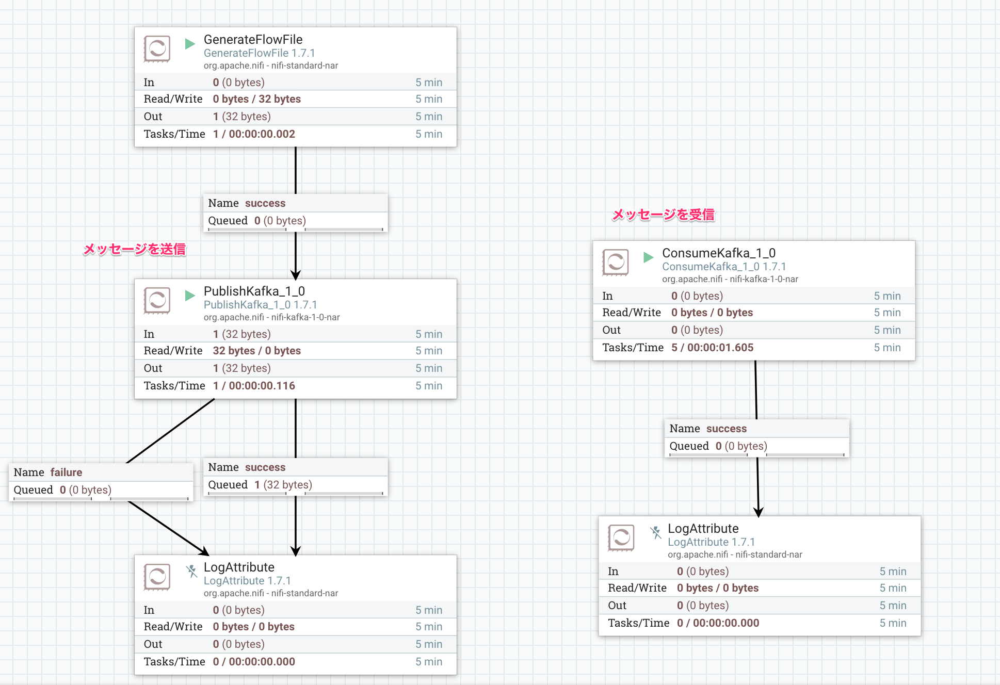

最近のデータ系システムでKafkaを見ないことがないくらいポピュラーで、一度Kafkaのトピックまでデータを届ければ、その先連携可能なアプリケーションは大きく広がります。NiFiは様々なデータ発生元からデータを収集でき、Kafkaへ渡すことができるので、NiFi -> Kafkaの流れをマスターすると非常に便利です。本チュートリアルではNiFiからKafkaへのメッセージ送信、受信の方法を学びましょう。

次のデータフローを作成します。Kafka接続先は[環境情報](env)を参照してください。

模範解答のtemplateは[こちら](templates/Kafka_Example.xml)。