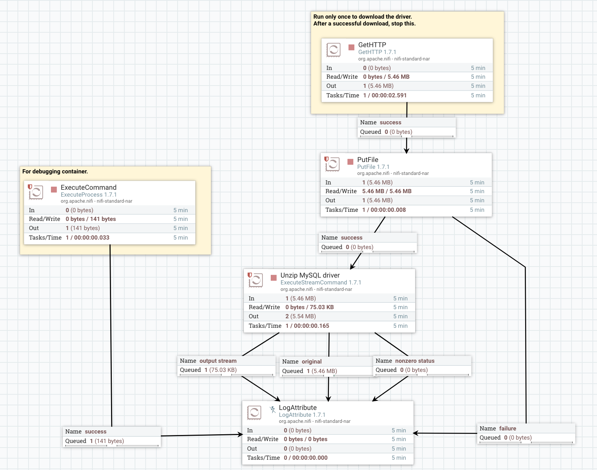

次のデータフローを実行すると、NiFiの起動しているDockerコンテナにMySQL JDBCドライバをダウンロードできます。AWS Fargateを使っているのでコンテナのOSにSSH接続はできないのですが、この方法ならDockerファイルをドライバをダウンロードしてNiFiのフローで使うことができますね。

templateは[こちら](templates/Download_MySQL_JDBC_Driver.xml)。