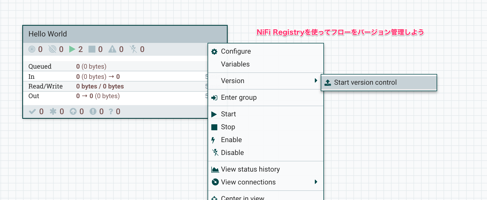

NiFiのようにGUIを使ってシステムをデザインするツールでは、「バージョン管理をどうするか」という点がしばしば課題になります。NiFi Registry登場前はTemplateやNiFi REST APIを利用してスクリプト化するのが常套手段でした。NiFi Registryを利用すると、より便利にフローのバージョン管理、異なる環境へのデプロイなどが可能です。

## 'Hello World' ProcessGroupをバージョン管理してみる

先のチュートリアル[Hello World](../hello-world)で作成したフローをバージョン管理してみましょう。

1. NiFi RegistryのUIから、新しいBucketを追加する [doc](https://nifi.apache.org/docs/nifi-registry-docs/html/user-guide.html#create-a-bucket)
1. NiFiで、Registry Clientを追加する [doc](https://nifi.apache.org/docs/nifi-docs/html/user-guide.html#connecting-to-a-nifi-registry)
    - 注: チュートリアル環境では、URLにサーバの**Private IP**を指定します、例`http://10.0.0.xx:18080`
1. NiFiで、'Hello World' ProcessGroupをバージョン管理開始する [doc](https://nifi.apache.org/docs/nifi-docs/html/user-guide.html#start-version-control)
1. バージョン管理された'Hello World'をNiFiにデプロイしてみる [doc](https://nifi.apache.org/docs/nifi-docs/html/user-guide.html#import-a-versioned-flow)
1. 'Hello World'のフローを変更し、新しいバージョンをコミットする [doc](https://nifi.apache.org/docs/nifi-docs/html/user-guide.html#managing_local_changes)
    - すでにデプロイされている古いバージョンの'Hello World'はどうなりますか?
    - 古いバージョンのProcessGroupをバージョンアップしてみましょう [doc](https://nifi.apache.org/docs/nifi-docs/html/user-guide.html#change-version)
